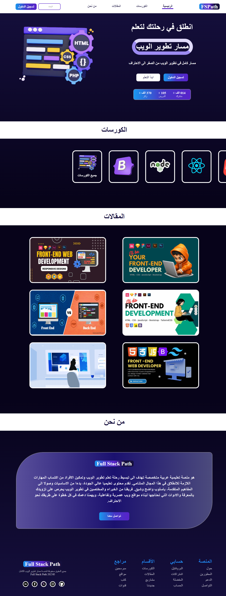

# 🌐 Web Learning Platform - منصة تعليمية لتطوير الويب

This is a basic **educational web platform** prototype built using only **HTML** and **CSS**, designed and implemented from scratch as a learning exercise.

> 💡 The project is entirely frontend and does not use JavaScript — it was built as part of my journey to become a professional frontend web developer.

---

## 📁 Pages Overview

The platform includes **4 pages**:

1. **Home Page**  
   - Introduction section
   - Login form with CSS-only toggle for "Create Account"
   - Course showcase section
   - Articles preview
   - About Us
   - Contact & References bar

2. **Courses Page**  
   - Displays all available web development courses.

3. **Articles Page**  
   - Lists various educational articles related to web development.

4. **About Page (in header)**  
   - Contains general information about the platform and contact info.

---

## 🎨 Technologies Used

- **HTML5**
- **CSS3**
  - Responsive design using `media queries`
  - Organized into two CSS files: main style and responsive rules

---

## 🚀 Goals of the Project

- Practice semantic HTML structure
- Design a clean, organized layout without using any frameworks
- Learn how to build multi-page websites
- Prepare a solid base for future JavaScript integration

---

## 🔗 Live Preview (GitHub Pages)

🔍 [Click here to view the site online]([https://yourusername.github.io/web-learning-platform/](https://mohamed-baslib.github.io/web-learning-platform/))  

---

## 🙋‍♂️ Author

**Mohammed Baslib**  
💻 Computer Science Student | 🌍 Yemen | 💡 Web Developer in Training

---

## 📝 Note

This is a self-built project created without any external templates, frameworks, or JavaScript libraries — just pure **effort**, **trial**, and **learning**. It's meant as a **foundation** for more advanced projects to come.

---

## 📸 Screenshots

---

## 🏷️ Tags

`#HTML` `#CSS` `#Responsive` `#WebDesign` `#Frontend` `#LearningProject` `#Portfolio`

